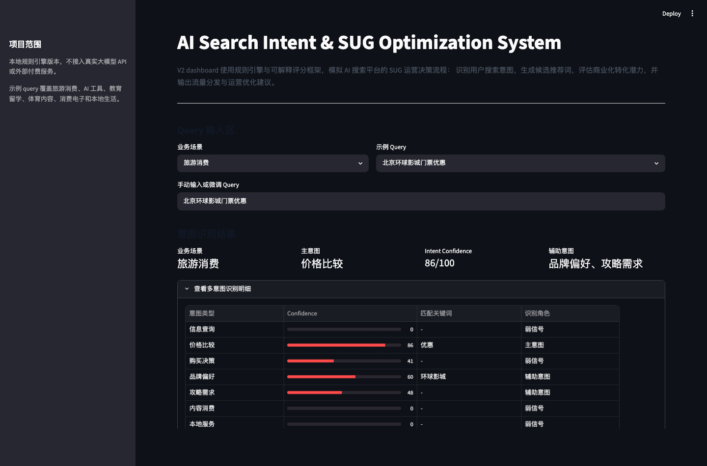
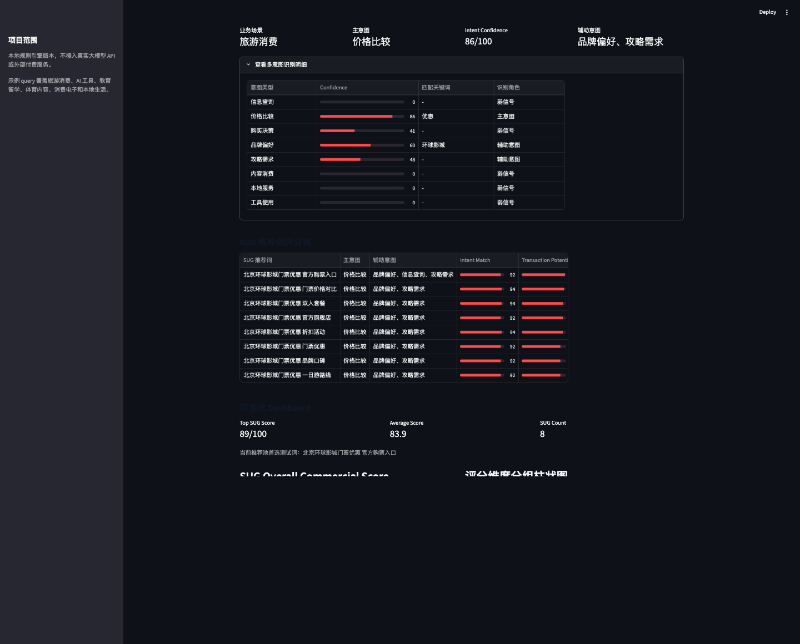
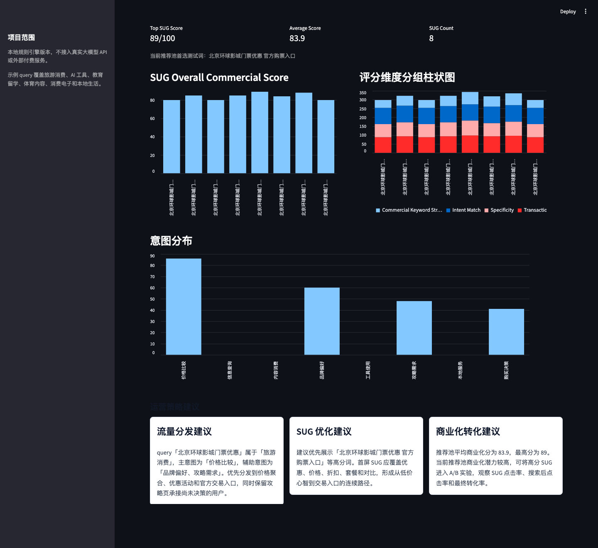

# AI Search Intent & SUG Optimization System

An AI product and search operations prototype that simulates how a search platform can identify user intent, generate SUG recommendations, score commercial potential, and translate the result into search operation strategy.

This is a local Streamlit V2 prototype. It uses a rule engine, curated sample queries, and an explainable heuristic scoring framework. It does not use real machine learning models, real search logs, paid LLM APIs, or any external API Key.

## Project Background

Search recommendation words, often called SUG or autocomplete suggestions, are a high-impact product surface. A small change in recommended words can influence search click-through rate, downstream page routing, purchase decisions, local service bookings, content subscriptions, and lead generation.

In AI search, content platforms, travel, education, local services, consumer electronics, and AI tool products, a user query often contains multiple signals:

- the information the user wants;
- the user's decision stage;
- whether the query has commercial intent;
- which landing page or traffic path should receive the user.

This project simulates the core decision process of an AI search platform in search recommendation operations: identify user search intent, generate candidate SUG words, evaluate commercial conversion potential, and output traffic distribution and operation optimization suggestions.

## Business Problem

Search product teams and search operation teams need to answer practical questions:

- What is the primary intent behind a query?
- Does the query also contain secondary intents such as price comparison, brand preference, or guide demand?
- Which SUG recommendations should be generated and ranked first?
- Which SUG words are more suitable for commercial experiments?
- Should traffic be routed to content pages, product pages, official entrances, local service pages, or subscription pages?

This dashboard turns those questions into a visible workflow for product review, technical walkthrough, and search operation analysis.

## Product Logic

The system follows a search product workflow:

```text
Query Input -> Intent Recognition -> SUG Generation -> Commercial Scoring -> Dashboard Visualization -> Operation Strategy Recommendation
```

1. **Query Input**: user selects a demo query or manually enters a query.
2. **Scenario Classification**: the system maps the query to a business scenario such as travel, AI tools, education, sports content, consumer electronics, or local services.
3. **Multi-Intent Recognition**: the system detects the primary intent and secondary intents.
4. **SUG Generation**: the system generates 5-8 recommendation words based on scenario and intent.
5. **Commercial Scoring**: each SUG is scored with an explainable four-dimensional framework.
6. **Dashboard Analysis**: the dashboard displays scoring tables, charts, and intent distribution.
7. **Operation Strategy**: the system outputs traffic distribution, SUG optimization, and conversion suggestions.

## Intent Recognition Method

The current version uses a rule engine rather than a trained model.

The rule engine contains:

- intent categories;
- keyword rules;
- scenario-level intent boosts;
- confidence normalization from 0 to 100;
- primary intent and secondary intent ranking.

Supported intent categories:

- 信息查询
- 价格比较
- 购买决策
- 品牌偏好
- 攻略需求
- 内容消费
- 本地服务
- 工具使用

The output is interpretable and easy to inspect. It is not intended to represent production-level intent classification accuracy.

## Scoring Framework

Each SUG receives an **Overall Commercial Score** from 0 to 100.

The score is deterministic and explainable. It is calculated from four dimensions:

| Dimension | Weight | Meaning |
| --- | ---: | --- |
| Intent Match | 35% | Whether the SUG matches the user's primary or secondary intent |
| Transaction Potential | 30% | Whether the SUG can guide users to purchase, booking, subscription, lead generation, or tool trial |
| Specificity | 20% | Whether the SUG is concrete enough to capture long-tail demand |
| Commercial Keyword Strength | 15% | Whether the SUG contains commercial terms such as price, discount, official entrance, subscription, trial, review, or booking |

The SUG scoring table includes:

- SUG 推荐词
- 主意图
- 辅助意图
- Intent Match
- Transaction Potential
- Specificity
- Commercial Keyword Strength
- Overall Commercial Score
- 推荐理由

## Dashboard Features

- Streamlit-based local dashboard;
- manual query input and demo query dropdown;
- 36 built-in demo queries across six business scenarios;
- multi-intent recognition with confidence scores;
- 5-8 SUG recommendations per query;
- explainable commercial scoring table;
- Overall Commercial Score bar chart;
- grouped scoring-dimension bar chart;
- intent distribution chart;
- dynamic strategy cards:
  - 流量分发建议
  - SUG 优化建议
  - 商业化转化建议
- methodology section for explaining the product design.

## Demo Examples

The demo query library covers:

| Scenario | Example Queries |
| --- | --- |
| 旅游消费 | 北京环球影城门票优惠, 上海迪士尼快速通行证, 日本东京自由行攻略, 欧洲申根签证价格 |
| AI 工具 | AI 数据分析工具, AI PPT 生成工具免费, ChatGPT 写论文怎么用, AI 翻译软件哪个好 |
| 教育留学 | 英国留学生租房攻略, 雅思口语一对一价格, 美国研究生申请条件, 留学中介机构推荐 |
| 体育内容 | 曼联比赛直播, NBA 湖人比赛回放, 英超赛程订阅, 欧冠决赛直播平台 |
| 消费电子 | 跑步手表推荐, iPhone 17 价格, 华为折叠屏手机评测, 游戏笔记本性价比 |
| 本地生活 | 上海周末亲子餐厅推荐, 北京牙齿矫正价格, 深圳搬家公司哪家好, 广州健身房年卡价格 |

## Demo Walkthrough

The following examples show how the current rule engine and scoring framework behave.

| Query | Main Intent | Secondary Intent | Example Top SUG | Commercial Score | Operation Strategy |
| --- | --- | --- | --- | ---: | --- |
| 北京环球影城门票优惠 | 价格比较 | 品牌偏好, 攻略需求 | 北京环球影城门票优惠 官方购票入口 | 89 | Route traffic to price aggregation, promotion pages, and official ticket entrances while keeping guide content for undecided users. |
| AI 数据分析工具 | 工具使用 | No clear secondary intent | AI 数据分析工具 对比评测 | 84 | Route users to tool trial, template, tutorial, and productivity pages to reduce first-use friction. |
| 曼联比赛直播 | 内容消费 | 品牌偏好 | 曼联比赛直播 会员订阅 | 77 | Prioritize live stream, replay, schedule, highlight, and membership subscription paths. |

These outputs are generated by local rules and heuristic scoring. They are useful for product reasoning and dashboard demonstration, not for claiming real online conversion performance.

## Screenshots

### Project Overview



### Intent Recognition and SUG Scoring



### Dashboard and Strategy Cards



## How to Run Locally

1. Enter the project directory:

```bash
cd ai-search-intent-sug-optimization
```

2. Create and activate a virtual environment:

```bash
python3 -m venv .venv
source .venv/bin/activate
```

3. Install dependencies:

```bash
pip install -r requirements.txt
```

4. Start Streamlit:

```bash
streamlit run app.py
```

5. Open the local URL shown in the terminal:

```text
http://localhost:8501
```

## File Structure

```text
AI Search Intent & SUG Optimization System/
├── app.py
├── data.py
├── utils.py
├── requirements.txt
├── README.md
├── assets/
│   └── screenshots/
│       ├── 01_project_overview.png
│       ├── 02_intent_sug_scoring.png
│       └── 03_dashboard_strategy_cards.png
├── docs/
│   └── project_notes.md
└── .gitignore
```

## Applicable Scenarios

This project is useful for explaining or discussing:

- Search operations;
- SUG keyword optimization;
- AI product prototyping;
- Commercial scoring simulation;
- Product management review;
- query understanding and intent taxonomy design;
- A/B testing candidate selection.

## Relevance to AI Product Commercialization

The project demonstrates how an AI product manager or data product manager can translate query understanding into commercial product decisions.

It shows:

- how user intent can influence search recommendation ranking;
- how SUG words can guide users into different conversion paths;
- how explainable scoring can support product and operation alignment;
- how a local rule-based prototype can validate product logic before model training or API integration.

## Limitations

- The current version uses a rule engine for intent recognition.
- The commercial score is based on heuristic rules and does not represent real online click-through rate, conversion rate, GMV, subscription rate, or lead conversion rate.
- The query library is simulated and curated for demo purposes.
- The system does not use real search logs, real user behavior data, real machine learning models, or real LLM APIs.
- Future versions can be improved by connecting search logs, A/B test results, user segments, or LLM APIs.

## Future Iterations

- Connect real search query data, SUG impressions, clicks, and conversion events.
- Use LLMs for intent recognition and SUG generation.
- Train a ranking model with real click-through and conversion data.
- Add an A/B testing simulation module.
- Generate personalized SUG words for different user segments.
- Add dashboards for cohort analysis by city, device, lifecycle stage, and historical behavior.
- Export recommended SUG candidates for search operation teams.

## Notes

- No external paid service is required.
- No API Key is required.
- No database is required.
- All sample data, intent rules, and scoring rules are stored locally in Python files.
